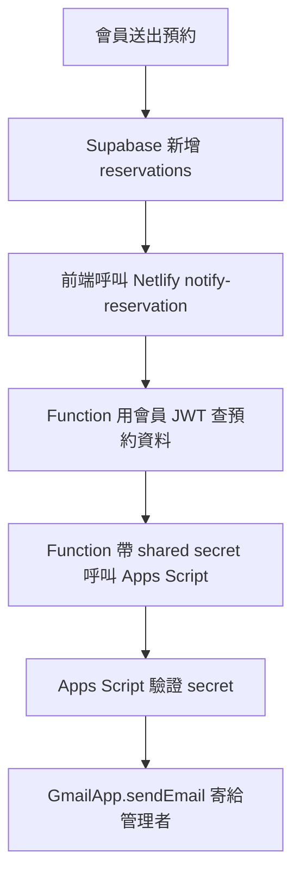
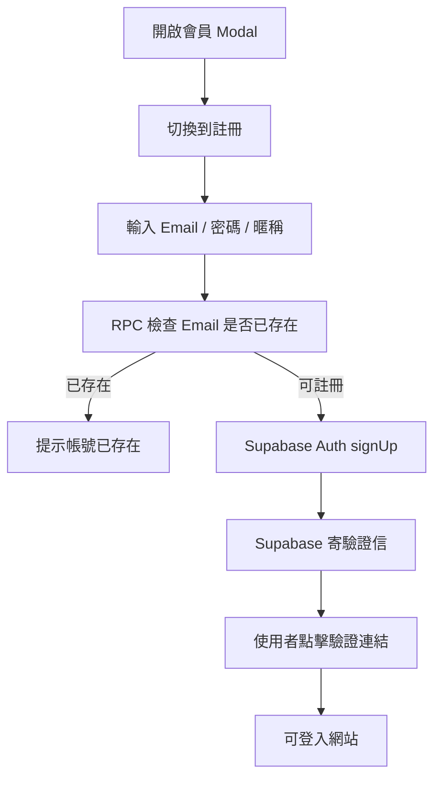
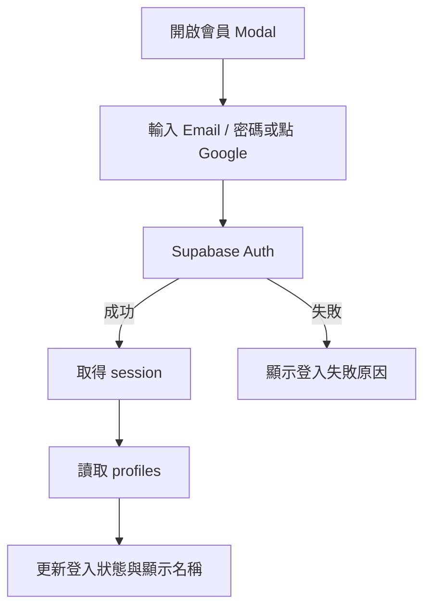
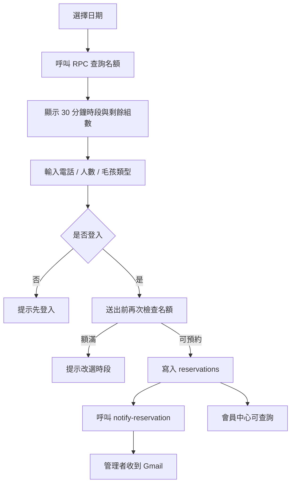
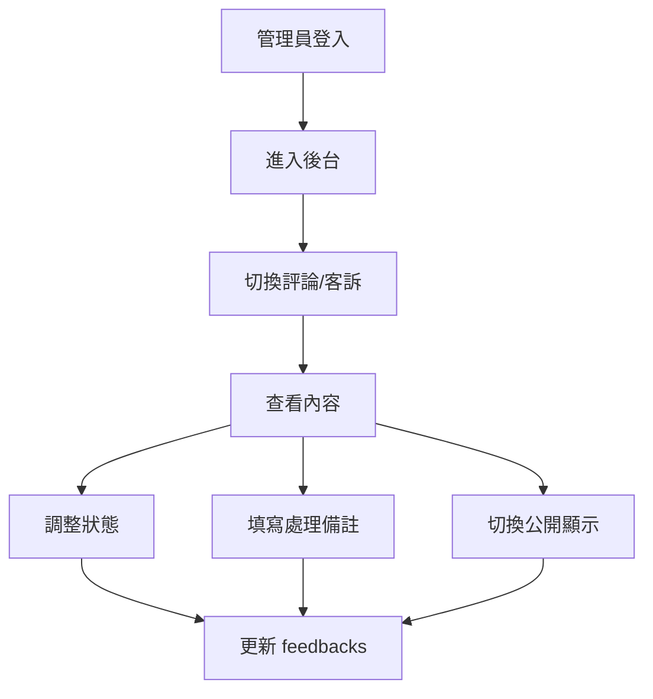
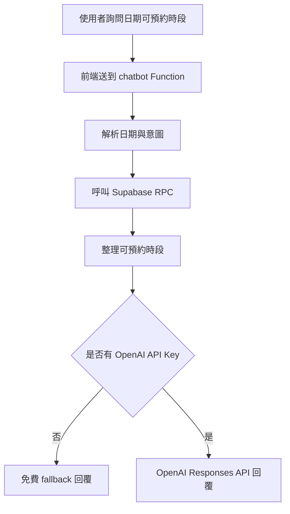

# 小翔動物友善餐廳專案說明

更新日期：2026-07-04
專案路徑：`D:\PetCafe`
專案名稱：`pet-cafe-home`
公開網站：[https://pet-cafe-home.netlify.app](https://pet-cafe-home.netlify.app)

## 1. 專案定位

本專案是以 React + Vite 製作的寵物友善餐廳網站，主題為「小翔動物友善餐廳」。網站已從單純首頁展示擴充為包含會員登入、預約、評論/客訴、後台管理、菜單管理、AI 聊天小幫手與預約通知的完整展示型 Side Project。

目前功能以免費方案優先：

- Supabase Free：會員、資料表、RLS、RPC。
- Netlify Free：靜態網站部署與 Functions。
- Google Apps Script / Gmail：預約成功後寄信通知管理者。
- AI 聊天：Phase 1 預設 `AI_PROVIDER=none`，以 Supabase 的預約 RPC、`menu_items` 與 `knowledge_items` 作為可信資料來源。

專案內另有 `petcafe-104-portfolio-video/`，該資料夾是作品影片素材與輸出，不屬於主站部署內容，部署時需要排除。

## 2. 技術架構

| 類型 | 使用技術 |
|---|---|
| 前端框架 | React 18 |
| 建置工具 | Vite |
| 樣式 | 原生 CSS，集中於 `src/styles.css` |
| Auth / Database | Supabase |
| 後端 API | Netlify Functions |
| 預約通知 | Netlify Function + Google Apps Script + Gmail |
| AI 聊天 | Netlify Function + Supabase grounded fallback |
| 部署 | Netlify Production |
| 主要語言 | JavaScript / JSX / TypeScript Function `.mts` / SQL / Google Apps Script |

## 3. 目前目錄結構

```text
D:\PetCafe
├─ .github/
│  └─ workflows/
│     └─ deploy.yml                         # GitHub Pages workflow，靜態部署用
├─ google-apps-script/
│  └─ reservation-notify.gs                  # Gmail 預約通知 Apps Script
├─ netlify/
│  └─ functions/
│     ├─ chatbot.mts                         # AI 聊天 Netlify Function
│     └─ notify-reservation.mts              # 預約成功後通知管理者 Function
├─ petcafe-104-portfolio-video/              # 影片素材資料夾，不參與主站部署
├─ src/
│  ├─ components/
│  │  ├─ AccountModal.jsx                    # 登入 / 註冊 / 會員狀態 Modal
│  │  ├─ AdminDashboard.jsx                  # 後台管理 UI
│  │  ├─ Chatbot.jsx                         # 右下角 AI 聊天 UI
│  │  ├─ FeedbackSection.jsx                 # 評論與客訴 UI
│  │  └─ ReservationForm.jsx                 # 預約表單 UI
│  ├─ lib/
│  │  └─ reservations.js                     # 預約時段與名額輔助函式
│  ├─ App.jsx                                # 主資料流與頁面組合
│  ├─ main.jsx                               # React 入口
│  ├─ styles.css                             # 全站樣式與 RWD
│  └─ supabaseClient.js                      # Supabase client 初始化
├─ supabase/
│  ├─ patch-feedback-admin-fields.sql        # 線上資料庫修補 SQL
│  └─ schema.sql                             # Supabase schema、RPC、RLS、grants
├─ .env.example                              # 環境變數範例
├─ .env.local                                # 本機環境變數，不提交
├─ .gitignore
├─ .netlifyignore                            # Netlify 上傳排除規則
├─ index.html
├─ netlify.toml                              # Netlify build / functions / SPA redirect
├─ package.json
├─ package-lock.json
├─ vite.config.js
└─ PROJECT_OVERVIEW.md                       # 本文件
```

## 4. 主要檔案職責

| 檔案 | 說明 |
|---|---|
| `src/App.jsx` | 主狀態與資料流，負責登入狀態、路由、預約、會員、後台、評論、AI 聊天資料串接 |
| `src/components/AccountModal.jsx` | 獨立登入 Modal，桌機與手機共用 |
| `src/components/ReservationForm.jsx` | 預約日期、時段、電話、人數、寵物類型表單 |
| `src/components/FeedbackSection.jsx` | 評論/客訴送出、列表、星等、分頁 |
| `src/components/AdminDashboard.jsx` | 後台預約月曆、回饋處理、會員列表、菜單管理 |
| `src/components/Chatbot.jsx` | AI 小幫手聊天視窗 |
| `src/lib/reservations.js` | 預約時段、時段開放判斷、RPC 結果轉換 |
| `src/supabaseClient.js` | 讀取 `VITE_SUPABASE_URL` 與 `VITE_SUPABASE_ANON_KEY` 建立 client |
| `netlify/functions/chatbot.mts` | 查詢預約時段、菜單、地址、營業時間、店家規則與免費 fallback 回覆 |
| `netlify/functions/notify-reservation.mts` | 預約後用會員 JWT 查詢該筆預約，再呼叫 Apps Script 寄 Gmail |
| `google-apps-script/reservation-notify.gs` | 接收 Netlify Function webhook，用 GmailApp 寄信給管理者 |
| `supabase/schema.sql` | Tables、Trigger、RPC、RLS、Grant 權限 |
| `supabase/patch-feedback-admin-fields.sql` | 線上補欄位與 RPC 修補檔 |
| `.netlifyignore` | 避免上傳 `petcafe-104-portfolio-video/` 等大型或不必要內容 |

## 5. 環境變數

### 5.1 前端公開變數

```env
VITE_SUPABASE_URL=https://your-project-ref.supabase.co
VITE_SUPABASE_ANON_KEY=your-public-anon-key
VITE_CHATBOT_ENDPOINT=/.netlify/functions/chatbot
```

注意：

- `VITE_` 開頭會進入前端 bundle，只能放公開可用的設定。
- Supabase anon key 是公開 key，但仍必須搭配 RLS policy 保護資料。
- 不可把 Supabase service role key 放到前端。

### 5.2 Netlify Function 伺服器端變數

```env
AI_PROVIDER=none
OPENAI_API_KEY=optional-openai-key
OPENAI_MODEL=optional-model-name
GMAIL_NOTIFY_WEBHOOK_URL=https://script.google.com/macros/s/xxxx/exec
GMAIL_NOTIFY_SECRET=your-shared-secret
```

注意：

- `AI_PROVIDER=none` 是目前 Phase 1 預設值，AI 聊天只使用 Supabase 可信資料與免費 fallback，不產生模型 API 成本。
- `OPENAI_API_KEY` 保留為未來選配 provider 設定；Phase 1 不呼叫 OpenAI。
- `GMAIL_NOTIFY_SECRET` 是 Netlify Function 與 Apps Script 之間的 shared secret，不應放在前端。
- 目前已確認線上 Function health check 可讀到 Gmail webhook URL 與 secret。

## 6. 現有功能

### 6.1 首頁展示

首頁包含：

- 主視覺區塊。
- 店內場景切換。
- 環景與貓狗合照輪播。
- 餐廳介紹。
- 預約區。
- 三語菜單區。
- 評論與客訴區。
- 右下角 AI 聊天小幫手。

### 6.2 登入與會員

登入 UI 已獨立為 Modal，避免手機版被頁面文字遮住。

支援：

- Email 註冊。
- Email 登入。
- Email 驗證信。
- Google OAuth 登入。
- 忘記密碼與更新密碼。
- 登出。
- 會員中心。
- 暱稱更新。
- 會員預約查詢。
- 會員自行取消預約。

登入狀態來源：

- Supabase Auth session。
- `profiles` table。

路由保護：

- 未登入進入 `/member` 會顯示提示，約 2.5 秒後回首頁。
- 非管理員或登出後進入 `/admin` 會顯示提示，約 2.5 秒後回首頁。
- 使用 `authInitialized` 避免 session 尚未載入時誤判跳轉。

### 6.3 預約功能

預約欄位：

- 日期。
- 時段。
- 電話。
- 人數。
- 毛孩類型。

目前規則：

- 只有登入會員可以送出預約。
- 預約時段固定為每 30 分鐘一格。
- 最早時段：`10:00`。
- 最後可預約時段：`21:00`。
- 每個時段最多 6 組。
- 額滿時段會 disabled。
- 送出前會再次查詢名額，避免多人同時預約造成超額。
- `pending` 與 `confirmed` 會占用名額。
- `cancelled` 與 `completed` 不占用名額。

預約成功後：

1. 寫入 Supabase `reservations`。
2. 前端呼叫 `/.netlify/functions/notify-reservation`。
3. Function 使用使用者 Supabase JWT 查詢該筆預約。
4. Function 呼叫 Google Apps Script。
5. Apps Script 用 Gmail 寄信給管理者。
6. 會員可在會員中心查詢該筆預約。

若管理者通知失敗：

- 預約仍會成功保存。
- 前端會顯示「管理者通知未送出」與錯誤原因，不再安靜略過。

### 6.4 Gmail 預約通知

目前寄信流程：



部署後驗證：

- Apps Script webhook 必須回傳 `{ "status": "sent" }`。
- Netlify Function health check 必須確認讀得到：
  - Supabase URL。
  - Supabase anon key。
  - Gmail webhook URL。
  - Gmail webhook secret。
- 以測試會員建立預約，確認管理者收到信；通知失敗時，會員端應仍保留成功建立的預約並顯示錯誤。

### 6.5 評論與客訴

功能：

- 登入會員可送出評論或客訴。
- 星等 1 到 5 顆。
- 所有訪客都能看到公開可見的評論/客訴。
- 支援篩選：全部、評論、客訴。
- 支援分頁。
- 管理者可處理回饋。

後台處理欄位：

- `status`：`new`、`reviewing`、`resolved`、`hidden`。
- `is_visible`：是否公開顯示。
- `admin_notes`：處理備註。
- `handled_at`：處理時間。

### 6.6 菜單功能

功能：

- 前台支援中文、英文、日文三語顯示。
- 有靜態 fallback 菜單。
- Supabase `menu_items` 有資料時會讀取資料庫內容。
- 後台可新增與編輯菜單品項。
- 菜單圖片目前使用 URL。

`menu_items.labels` 使用 JSONB 儲存多語資料。

### 6.7 後台管理

管理員判斷：

- `profiles.role = 'admin'`。

後台分頁：

- 預約管理。
- 評論/客訴處理。
- 會員列表。
- 菜單管理。

預約管理：

- 月曆檢視。
- 選取日期後看當日預約。
- 可更新狀態：`pending`、`confirmed`、`cancelled`、`completed`。

評論/客訴處理：

- 可更新處理狀態。
- 可切換公開顯示。
- 可填寫處理備註。
- 狀態為 `reviewing`、`resolved`、`hidden` 時會更新 `handled_at`。

### 6.8 AI 聊天小幫手

右下角浮動聊天 UI。

可回答：

- 指定日期有哪些可預約時段。
- 啟用中的資料庫菜單品項與價格。
- `knowledge_items` 中已啟用的地址、營業時間、FAQ、寵物規則、預約規則、取消規則與政策。
- 簡短閒聊。

目前規則：

- 地址尚未正式設定時，回覆「地址尚未設定，請聯繫店家確認。」
- 詢問預約時段時，呼叫 `get_reservation_availability(check_date date)`。
- 詢問菜單時，只讀取 `menu_items.is_active = true` 的品項；特定品項問題會用菜名與描述進行中文關鍵字評分，只回覆最高分相關品項。
- 詢問店家知識時，只讀取 `knowledge_items.is_active = true` 的內容；資料缺失時不猜測。
- AI 回覆不直接建立預約，只協助查詢與引導。
- `AI_PROVIDER=none` 時一般聊天走免費 fallback。
- Phase 1 未實作 Ollama、OpenAI、OpenRouter、Groq、Gemini、向量 RAG、embeddings 或知識庫後台 UI。

## 7. Supabase 資料庫設計

### 7.1 `profiles`

用途：會員資料與角色。

主要欄位：

- `id`：對應 `auth.users.id`。
- `email`。
- `nickname`。
- `role`：`user` 或 `admin`。
- `created_at`。
- `updated_at`。

### 7.2 `reservations`

用途：預約資料。

主要欄位：

- `id`。
- `user_id`。
- `user_name`。
- `reserve_date`。
- `reserve_time`。
- `phone`。
- `people`。
- `pet`。
- `status`：`pending`、`confirmed`、`cancelled`、`completed`。
- `created_at`。

### 7.3 `feedbacks`

用途：評論與客訴。

主要欄位：

- `id`。
- `user_id`。
- `user_name`。
- `type`：`review` 或 `complaint`。
- `rating`：1 到 5。
- `message`。
- `status`。
- `is_visible`。
- `admin_notes`。
- `handled_at`。
- `created_at`。

### 7.4 `menu_items`

用途：資料庫菜單。

目前 live Supabase 已同步前台預設 6 筆菜單，圖片 URL 沿用 `src/App.jsx` 的預設菜單資料。後台管理員可新增、編輯、停用菜單；AI 小幫手只會讀取 `is_active = true` 的品項。

主要欄位：

- `id`。
- `labels` JSONB。
- `price`。
- `image`。
- `is_active`。
- `sort_order`。
- `created_at`。
- `updated_at`。

### 7.5 `knowledge_items`

用途：AI 客服可信知識庫。

主要欄位：

- `id`。
- `category`：`store_info`、`business_hours`、`address`、`pet_rules`、`reservation_rules`、`cancellation_rules`、`faq`、`policy`。
- `title`。
- `content`。
- `keywords`。
- `is_active`。
- `created_at`。
- `updated_at`。

## 8. Supabase RPC / Trigger

### 8.1 `handle_new_user()`

Auth 新會員建立時，自動建立 `profiles` 資料。

### 8.2 `is_email_registered(check_email text)`

註冊前檢查 Email 是否已存在，避免重複註冊。

### 8.3 `is_admin()`

供 RLS policy 與後台權限判斷使用。

### 8.4 `cancel_own_reservation(reservation_id uuid)`

會員取消自己的預約。

規則：

- 只能取消自己的預約。
- 只允許取消 `pending` 或 `confirmed`。
- 成功後狀態改為 `cancelled`。

### 8.5 `get_reservation_availability(check_date date)`

查詢指定日期各時段剩餘名額。

規則：

- 產生 `10:00` 到 `21:00` 的 30 分鐘時段。
- 每時段最多 6 組。
- `pending`、`confirmed` 占用名額。
- `cancelled`、`completed` 不占用名額。
- 過去日期不可預約。
- `anon` 與 `authenticated` 都可執行。

## 9. RLS 權限概念

所有主要資料表皆啟用 Row Level Security。

大致規則：

- `profiles`：會員可讀/改自己的 profile，管理員可讀所有 profile。
- `reservations`：會員可新增/讀自己的預約，管理員可讀/更新所有預約。
- `feedbacks`：會員可新增，所有人可讀 `is_visible = true` 的內容，管理員可讀/更新所有回饋。
- `menu_items`：所有人可讀啟用中品項，管理員可管理品項。
- `knowledge_items`：所有人可讀啟用中知識項目，管理員可新增、更新與停用知識項目。

## 10. 前端流程

### 10.1 註冊流程



### 10.2 登入流程



### 10.3 預約流程



### 10.4 管理員處理客訴流程



### 10.5 AI 查詢預約流程



## 11. Netlify 部署

`netlify.toml` 設定：

- Build command：`npm run build`。
- Publish directory：`dist`。
- Functions directory：`netlify/functions`。
- SPA fallback：`/* -> /index.html`。

部署注意：

- `petcafe-104-portfolio-video/` 是大型影片素材，不應上傳。
- 已使用 `.netlifyignore` 排除大型資料夾與不必要檔案。
- 實際部署時建議使用乾淨暫存資料夾，只複製必要網站檔案。
- 目前公開站由 Netlify Production 提供。

## 12. GitHub Pages 注意事項

專案仍有 `.github/workflows/deploy.yml`，但 GitHub Pages 是靜態部署，無法直接執行 Netlify Functions。

若只使用 GitHub Pages：

- AI 聊天 Function 不會在同一網域可用。
- 預約 Gmail 通知 Function 不會在 GitHub Pages 執行。
- 若要 GitHub Pages 使用這些功能，必須將 endpoint 指到 Netlify Function 完整 URL。

目前建議以 Netlify 作為主部署平台。

## 13. 本機開發指令

```bash
npm install
npm run dev
npm run build
npm run preview
```

常用網址：

```text
http://127.0.0.1:5173/
http://localhost:5173/
```

注意：

- 若只跑 Vite dev server，`/.netlify/functions/...` 不一定會完整模擬 Netlify Functions。
- 若要完整測 Function，應使用 Netlify 環境或正式部署後測試。

## 14. 部署前檢查清單

建議每次部署前檢查：

```bash
npm run build
npx esbuild netlify/functions/notify-reservation.mts --bundle --platform=node --format=esm --outfile=%TEMP%\notify-reservation-test.mjs
npx esbuild netlify/functions/chatbot.mts --bundle --platform=node --format=esm --outfile=%TEMP%\chatbot-test.mjs
```

也應確認：

- Supabase RPC 最後時段為 `21:00:00`。
- `menu_items` 至少有啟用中的菜單資料，並可用匿名 key 讀取。
- `feedbacks.admin_notes` 與 `feedbacks.handled_at` 已存在。
- Apps Script webhook 回傳 `sent`。
- Netlify notify health check 四項皆為 `true`。

Health check：

```text
https://pet-cafe-home.netlify.app/.netlify/functions/notify-reservation?health=1
```

預期結果：

```json
{
  "ok": true,
  "hasSupabaseUrl": true,
  "hasSupabaseAnonKey": true,
  "hasGmailWebhookUrl": true,
  "hasGmailWebhookSecret": true
}
```

## 15. 已知限制

- `App.jsx` 仍保留主要資料流，雖然 UI 已拆成元件，但狀態管理仍集中。
- Supabase schema 目前以 SQL 檔維護，尚未建立正式 migration 流程。
- 預約容量每時段 6 組仍寫死在 RPC。
- 營業時間與預約時段仍寫在前端與 RPC，尚未改為資料庫設定。
- 店家地址尚未正式設定。
- OpenAI API 若啟用會產生成本，因此目前維持可 fallback。
- Gmail Apps Script 是免費方案，但寄件限制與 Google 帳號政策仍由 Google 控制。
- Health check 會顯示環境變數是否存在，但不會暴露 secret 內容。

## 16. 建議後續擴充

### 16.1 預約系統

- 將營業時間、最後預約時間、每時段容量改成資料庫設定。
- 支援公休日與特殊營業日。
- 後台可手動新增電話預約。
- 支援候補名單。
- 預約前一天自動提醒會員。
- 顧客預約成功也寄一封確認信。

### 16.2 後台管理

- 儀表板：今日預約、待處理客訴、平均評分。
- 預約月曆改為週/月切換。
- 搜尋會員、預約、客訴。
- 匯出 CSV。
- 管理員操作紀錄 audit log。
- 管理員權限分級。

### 16.3 評論與客訴

- 管理員公開回覆。
- 圖片上傳。
- 客訴處理通知。
- 平均星等統計。
- 防洗版與敏感詞過濾。

### 16.4 會員系統

- 會員寵物資料卡。
- 常用電話自動帶入。
- 會員頭像。
- 會員點數與等級。
- OAuth 帳號綁定/解除。

### 16.5 菜單系統

- 菜單分類。
- 熱門/推薦標籤。
- 售完或暫停供應狀態。
- 過敏原與素食標籤。
- 圖片上傳到 Supabase Storage。
- 多語系後台翻譯管理。

### 16.6 AI 小幫手

- 將 FAQ 存入資料庫供 AI 查詢。
- 讓 AI 讀取菜單資料。
- 讓 AI 讀取營業設定表。
- 設定每日使用上限避免成本失控。
- 聊天記錄進後台查看。
- 加強防止 AI 編造地址、價格或不存在政策。

### 16.7 工程品質

- 將 `App.jsx` 的資料流繼續拆成 hooks。
- 建立 `src/hooks/`、`src/services/`、`src/data/`。
- 導入 ESLint / Prettier。
- 建立 Supabase migrations。
- 加入 E2E 測試。
- 建立 staging / production 環境。
- 部署前自動跑 health check。

## 17. 建議下一步優先順序

1. 建立正式 Supabase migration 流程，避免本機 SQL 與線上資料庫不同步。
2. 將營業時間、預約時段、容量移到資料庫設定表。
3. 將 `App.jsx` 狀態與 Supabase 操作拆成 hooks / services。
4. 補顧客預約確認信。
5. 補後台儀表板與搜尋。
6. 若要啟用 OpenAI，先設定用量上限與 fallback。
