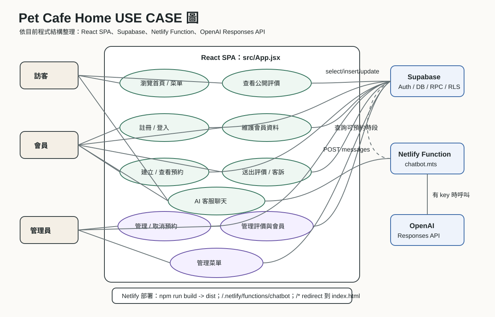

# Pet Cafe Home

寵物友善咖啡廳的前台網站與簡易營運後台。專案以 Vite + React 建立單頁應用，使用 Supabase Auth / Database 處理會員、預約、評價與菜單資料，並透過 Netlify Function 提供 AI 客服與可預約時段查詢。



## 目前做什麼

- 訪客可以瀏覽首頁、菜單、環境照片與公開評價。
- 會員可以用 Email 或 Google 登入、維護暱稱、建立預約、查看自己的預約、取消自己的預約、送出評價或客訴。
- 管理員可以查看會員、預約、評價與菜單資料，並更新預約狀態、評價顯示狀態、菜單項目。
- AI 客服可以接收前端聊天訊息；有 OpenAI key 時走 OpenAI Responses API，沒有 key 時使用內建 fallback 回覆。遇到預約時段問題會查 Supabase RPC。

## 技術架構

| 層級 | 實作位置 | 職責 |
| --- | --- | --- |
| 前端入口 | `src/main.jsx` | 掛載 React app 與全站樣式 |
| 主要 UI / 流程 | `src/App.jsx` | 路由、登入、會員、預約、評價、菜單、管理後台、聊天 |
| Supabase client | `src/supabaseClient.js` | 讀取 `VITE_SUPABASE_URL`、`VITE_SUPABASE_ANON_KEY` 並建立 client |
| Serverless API | `netlify/functions/chatbot.mts` | AI 客服、可預約時段查詢、OpenAI fallback |
| 資料庫 schema | `supabase/schema.sql` | tables、RLS policies、RPC functions、trigger |
| 部署設定 | `netlify.toml` | Vite build、Netlify Functions、SPA redirect |

更完整的流程架構請看 [docs/architecture-zh.md](docs/architecture-zh.md)。

## 核心資料表

| table | 用途 |
| --- | --- |
| `profiles` | 會員資料、暱稱、角色。`role = admin` 時可進管理後台 |
| `reservations` | 預約資料，包含日期、時間、人數、寵物類型、電話與狀態 |
| `feedbacks` | 評價與客訴，包含評分、訊息、處理狀態與是否公開 |
| `menu_items` | 可管理的菜單項目，使用 `labels` JSONB 支援多語內容 |

## 主要流程

1. 使用者進入網站，React 依目前 URL 判斷 `home`、`member` 或 `admin` route。
2. 若 Supabase 環境變數存在，前端會讀取 session 並監聽 auth state。
3. 登入成功後載入 `profiles`；如果角色是 `admin`，額外載入管理後台資料。
4. 會員建立預約或評價時，前端寫入 Supabase。RLS 會限制只能建立自己的資料。
5. 管理員更新預約、評價或菜單時，前端寫入對應 table。RLS 透過 `is_admin()` 檢查權限。
6. 使用者開啟 AI 客服時，前端呼叫 `/.netlify/functions/chatbot`；Function 視問題內容查詢可預約時段或呼叫 OpenAI。

## 本機執行

```powershell
npm install
npm run dev
```

建置：

```powershell
npm run build
```

## 環境變數

請以 `.env.example` 為模板設定：

```env
VITE_SUPABASE_URL=https://your-project-ref.supabase.co
VITE_SUPABASE_ANON_KEY=your-anon-public-key
VITE_CHATBOT_ENDPOINT=/.netlify/functions/chatbot
OPENAI_API_KEY=your-openai-api-key
OPENAI_MODEL=gpt-5-nano
```

## 已知狀況

- `src/App.jsx` 與 `netlify/functions/chatbot.mts` 目前有大量中文文案呈現 mojibake 亂碼。文件中的功能判讀以可驗證的程式結構、Supabase 呼叫、schema 與設定檔為準。
- 若 Supabase 未設定，部分功能會退回前端暫存或提示設定缺失；正式環境應設定 Supabase URL 與 anon key。
- 若未設定有效 `OPENAI_API_KEY`，AI 客服會使用 `free-fallback` 模式，不會呼叫 OpenAI API。
