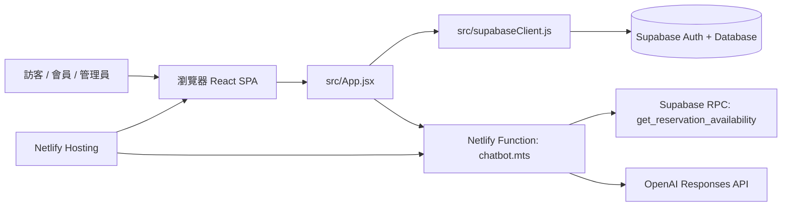
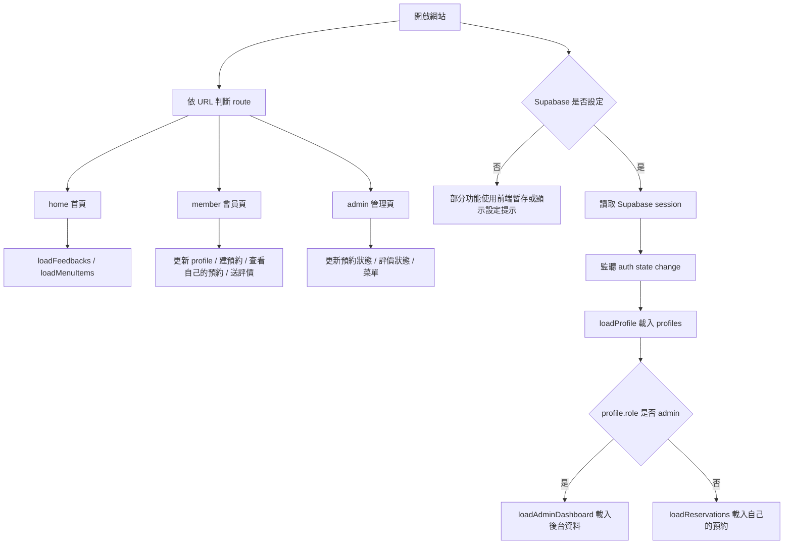
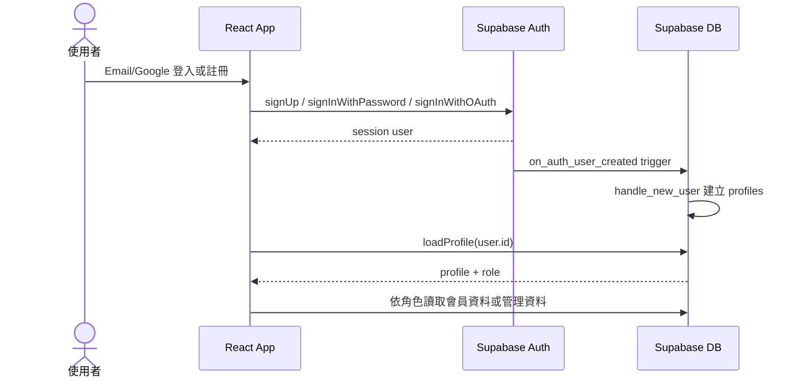
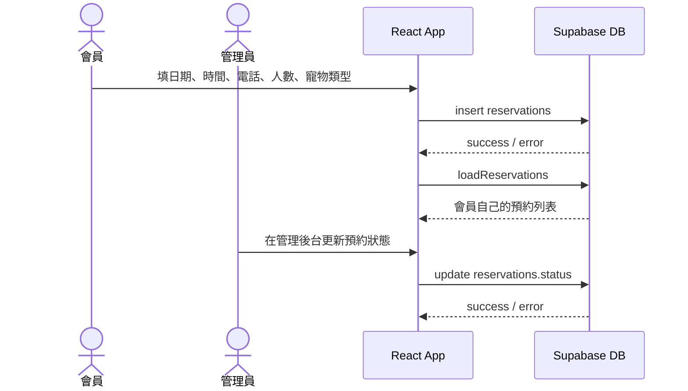
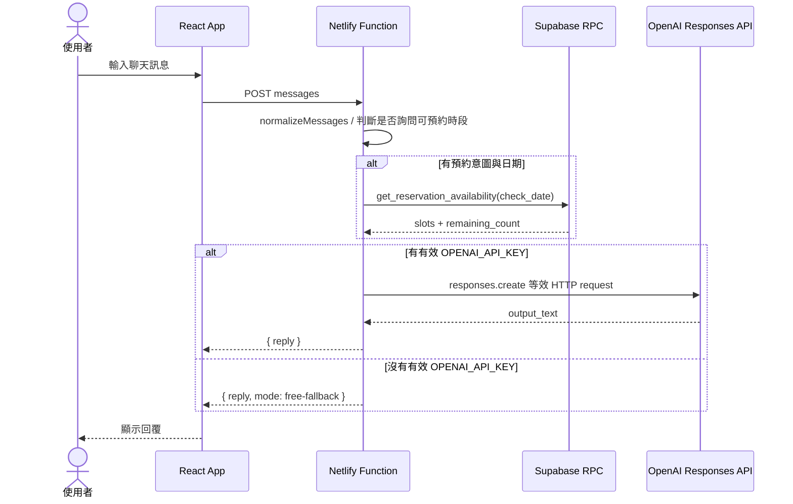

# Pet Cafe Home 中文流程架構

本文根據目前專案檔案撰寫，目標是讓維護者快速知道「有哪些組件」、「組件如何對應」、「流程怎麼串」。已確認來源包含 `package.json`、`src/main.jsx`、`src/App.jsx`、`src/supabaseClient.js`、`netlify/functions/chatbot.mts`、`supabase/schema.sql`、`netlify.toml` 與 `.env.example`。

> 注意：目前 `src/App.jsx` 與 `netlify/functions/chatbot.mts` 有大量中文文案 mojibake。以下分析避開不可讀文案，改以實際函式、狀態、資料表、RPC 與 API 呼叫判斷流程。

## 一、系統總覽



系統是一個部署在 Netlify 的 React 單頁應用。前端直接透過 Supabase client 操作 Auth 與資料表；AI 客服則透過 Netlify Function 隔離 OpenAI API key，並在需要查詢預約可用時段時呼叫 Supabase RPC。

## 二、組件對應關係

| 使用者看到的功能 | 前端狀態 / 函式 | Supabase / API 對應 | 說明 |
| --- | --- | --- | --- |
| 首頁瀏覽 | `route = home`、`heroScenes`、`gallery` | 無直接 DB 必要 | 首頁、照片輪播、菜單與評價區塊 |
| 菜單顯示 | `loadMenuItems()`、`menuEntries` | `menu_items` select active rows | 若 Supabase 有資料，使用 DB 菜單；否則使用前端預設資料 |
| 公開評價 | `loadFeedbacks()`、`feedbackEntries` | `feedbacks` select `is_visible = true` | 顯示公開評價 / 客訴，前端支援分頁與篩選 |
| Email 註冊 | `handleEmailAuth()` | `is_email_registered()`、`supabase.auth.signUp()` | 註冊前先查 email 是否存在，註冊後由 trigger 建 profile |
| Email 登入 | `handleEmailAuth()` | `supabase.auth.signInWithPassword()` | 登入後 auth listener 載入 profile |
| Google 登入 | `handleGoogleLogin()` | `supabase.auth.signInWithOAuth()` | OAuth redirect 回站台 |
| 忘記 / 更新密碼 | `handlePasswordResetRequest()`、`handlePasswordUpdate()` | `resetPasswordForEmail()`、`updateUser()` | 使用 Supabase Auth recovery flow |
| 會員資料 | `loadProfile()`、`handleProfileUpdate()` | `profiles` select / update | 使用者只能讀寫自己的 profile；admin 可讀全部 |
| 建立預約 | `handleReservation()` | `reservations` insert | 需要登入；RLS 限制 `auth.uid() = user_id` |
| 查看自己的預約 | `loadReservations()`、`myReservations` | `reservations` select | 會員頁目前只列出自己的預約，沒有提供取消按鈕 |
| 送出評價 / 客訴 | `handleFeedbackSubmit()` | `feedbacks` insert | 需要登入；公開顯示由 `is_visible` 控制 |
| 管理預約 | `loadAdminDashboard()`、`updateReservationStatus()` | `reservations` select / update | 只有 `profiles.role = admin` 可操作；取消預約目前由管理員改狀態完成 |
| 管理評價 | `updateFeedbackAdminFields()` | `feedbacks` update status / is_visible | 管理員可調整處理狀態與公開狀態 |
| 管理會員 | `loadAdminDashboard()` | `profiles` select | 管理員讀取會員列表 |
| 管理菜單 | `handleAdminMenuSubmit()` | `menu_items` insert / update | 管理員新增或更新菜單 |
| AI 客服 | `handleChatSubmit()` | `/.netlify/functions/chatbot` | 前端送最近聊天訊息到 Netlify Function |
| 查詢可預約時段 | `chatbot.mts` | RPC `get_reservation_availability()` | Function 解析日期意圖後查詢剩餘名額 |
| AI 生成回覆 | `chatbot.mts` | OpenAI Responses API | 有有效 `OPENAI_API_KEY` 時呼叫；否則 fallback |

## 三、前端流程



前端沒有使用 React Router，而是透過 `window.history.pushState()`、`popstate` 與 `getRouteFromPath()` 管理 `home`、`member`、`admin` 三個 route。Netlify 以 `/* -> /index.html` redirect 支援 SPA 直接開啟子路徑。

## 四、會員與權限流程



權限的核心在 `supabase/schema.sql`：

- `profiles.role` 決定 `user` 或 `admin`。
- `is_admin()` 用目前 `auth.uid()` 查 `profiles.role = admin`。
- RLS 已啟用於 `profiles`、`reservations`、`feedbacks`、`menu_items`。
- 會員只能操作自己的 profile、預約與評價新增。
- 管理員可讀取與更新營運資料。

## 五、預約流程



目前會員頁會顯示自己的預約清單，但沒有提供取消按鈕。程式中雖然存在 `handleCancelReservation()` 與 RPC `cancel_own_reservation()`，但未在會員預約清單 JSX 中接上操作入口；以目前可操作流程為準，取消預約是管理員在後台修改 `reservations.status`。

可預約時段不是在建立預約時直接檢查，而是在 AI 客服流程中透過 `get_reservation_availability(check_date)` 查詢。該 RPC 以 10:00 到 22:00、每 30 分鐘一格產生 slot，計算 pending / confirmed 的已訂數量，並以每個時段 6 筆作為剩餘名額基準。

## 六、AI 客服流程



`chatbot.mts` 的關鍵設計：

- `getEnv()` 同時支援 Netlify env 與 `process.env`。
- `OPENAI_API_KEY` 不存在或不是 `sk-` 開頭時不呼叫 OpenAI，改用 fallback。
- 預約查詢使用 Supabase anon key 呼叫 REST RPC。
- OpenAI model 預設為 `gpt-5-nano`，可由 `OPENAI_MODEL` 覆蓋。

## 七、資料庫與 RLS 對應

| 資料表 / RPC | 被誰使用 | 前端 / Function 對應 | 權限重點 |
| --- | --- | --- | --- |
| `profiles` | 會員、管理員 | `loadProfile()`、`handleProfileUpdate()`、`loadAdminDashboard()` | 會員讀寫自己；admin 讀全部 |
| `reservations` | 會員、管理員 | `handleReservation()`、`loadReservations()`、`updateReservationStatus()` | 會員新增 / 讀自己；admin 讀寫全部並可改成 cancelled |
| `feedbacks` | 訪客、會員、管理員 | `loadFeedbacks()`、`handleFeedbackSubmit()`、`updateFeedbackAdminFields()` | 訪客讀公開；會員新增；admin 讀寫 |
| `menu_items` | 訪客、管理員 | `loadMenuItems()`、`handleAdminMenuSubmit()` | 訪客讀 active；admin 管理 |
| `is_email_registered()` | 註冊流程 | `handleEmailAuth()` | anon / authenticated 可執行 |
| `is_admin()` | RLS policy | schema policies | authenticated 可執行 |
| `cancel_own_reservation()` | 尚未接到目前會員 UI | `handleCancelReservation()` | DB 與 handler 存在，但目前會員畫面沒有操作入口 |
| `get_reservation_availability()` | AI 客服查時段 | `chatbot.mts` | anon / authenticated 可執行 |

## 八、部署流程

```mermaid
flowchart LR
  git[GitHub Repository] --> netlify[Netlify Build]
  netlify --> build[npm run build]
  build --> dist[dist]
  netlify --> functions[netlify/functions]
  dist --> site[Static Site]
  functions --> api[/.netlify/functions/chatbot]
  site --> redirect[/* -> /index.html]
```

`netlify.toml` 指定：

- build command: `npm run build`
- publish directory: `dist`
- function directory: `netlify/functions`
- SPA redirect: `/*` 到 `/index.html`

## 九、目前風險與建議

1. 中文文案亂碼：目前不影響從程式結構辨識功能，但會影響使用者體驗與維護。建議後續優先修復原始中文字串編碼。
2. 前端大型單檔：`src/App.jsx` 同時承擔 UI、資料存取與流程控制，後續可拆成 auth、reservation、feedback、admin、chatbot 等 hooks 或 modules。
3. 會員取消預約流程未接 UI：`cancel_own_reservation()` 與 `handleCancelReservation()` 存在，但會員預約列表沒有取消按鈕；目前取消由管理員改狀態處理。
4. 預約容量檢查位置：目前 `get_reservation_availability()` 可查剩餘量，但建立預約時未看到同等容量檢查。若正式營運需要避免超額預約，建議加入 DB transaction / RPC 建立預約。
5. 管理員菜單只支援新增與更新：目前未看到刪除菜單項目的流程；這符合保守資料策略，也可用 `is_active = false` 做下架。
6. OpenAI key 只在 Function 端使用：這是正確方向，避免把 private key 放到前端 bundle。
